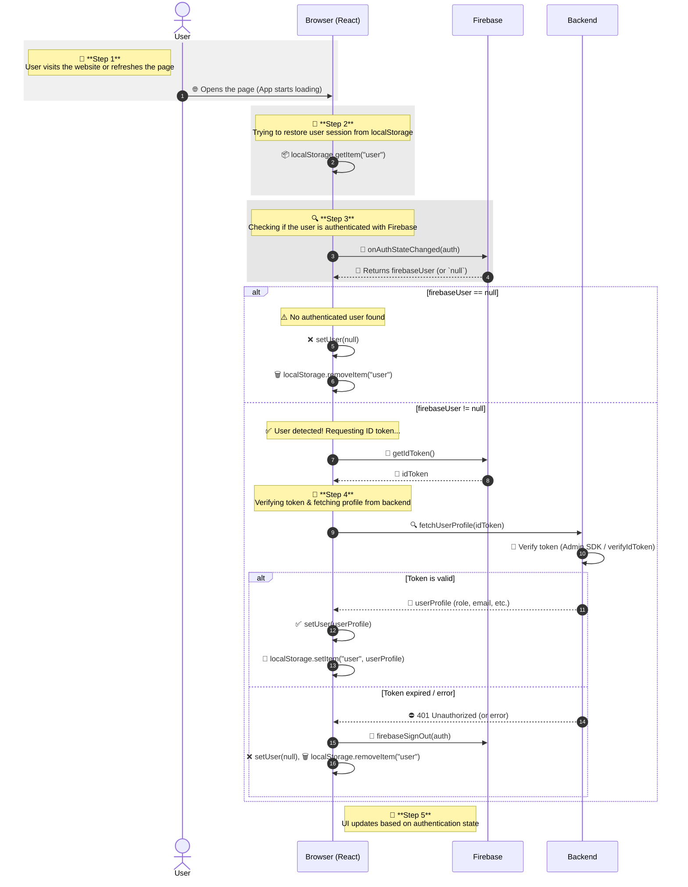

# Portfolio Backend

## 📌 Description

This backend is responsible for handling authentication, user session management, and API endpoints for my portfolio project. It integrates with **Firebase Authentication** to verify users and manages stored portfolio data using **MongoDB**.

---

## 🛠 Technology Stack

- **Backend**: Node.js, Express.js  
- **Authentication**: Firebase Authentication (Google, GitHub)  
- **Database**: MongoDB  
- **Session Management**: JSON Web Tokens (JWT)  

---

## 🔄 Authentication Flow



---

## 📂 Project Structure

```
/backend
│── config/
│   ├── firebase.js  # Firebase Admin SDK setup
│   ├── database.js  # MongoDB connection
│── routes/
│   ├── auth.js      # Authentication routes (login, logout)
│   ├── user.js      # User profile management
│── models/
│   ├── User.js      # Mongoose schema for user data
│── middleware/
│   ├── authMiddleware.js  # Middleware to verify JWT tokens
│── server.js        # Main Express server entry point
│── package.json     # Dependencies and scripts
```

---

## 🚀 API Endpoints

### 🔐 Authentication

#### ✅ Verify Token
**POST** `/api/auth/verify`  
Verifies the Firebase ID token and returns user data.  

**Request:**  
```json
{
  "idToken": "eyJhbGciOiJI..."
}
```
**Response:**  
```json
{
  "user": {
    "id": "123456",
    "email": "user@example.com",
    "role": "admin"
  }
}
```

---

### 👤 User Profile

#### 📄 Get User Profile
**GET** `/api/user/profile`  
Returns the logged-in user's profile information.  

**Headers:**  
```json
{
  "Authorization": "Bearer <JWT_TOKEN>"
}
```
**Response:**  
```json
{
  "id": "123456",
  "name": "John Doe",
  "email": "user@example.com",
  "role": "admin"
}
```

---

## 📜 Installation & Setup

1️⃣ **Clone the repository**  
```bash
git clone https://github.com/yourusername/portfolio-backend.git
cd portfolio-backend
```

2️⃣ **Install dependencies**  
```bash
npm install
```

3️⃣ **Set up environment variables** (`.env`)  
```
PORT=5000
MONGO_URI=mongodb+srv://your_mongo_url
FIREBASE_CREDENTIALS=path/to/serviceAccountKey.json
JWT_SECRET=your_jwt_secret
```

4️⃣ **Run the server**  
```bash
npm start
```

Server will be running on **http://localhost:5000** 🚀  

---

## 🔗 Useful Links

1. 🔗 [Firebase Authentication Docs](https://firebase.google.com/docs/auth)  
2. 🛠 [Express.js Docs](https://expressjs.com/)  
3. 🛢 [MongoDB Mongoose Docs](https://mongoosejs.com/docs/)  
4. 🔑 [JWT Token Guide](https://jwt.io/)  
